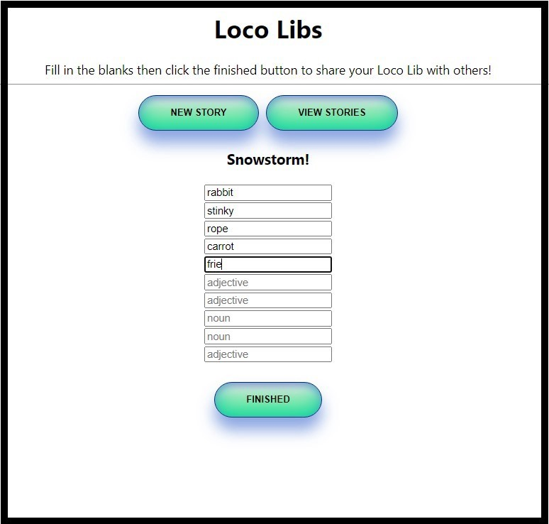
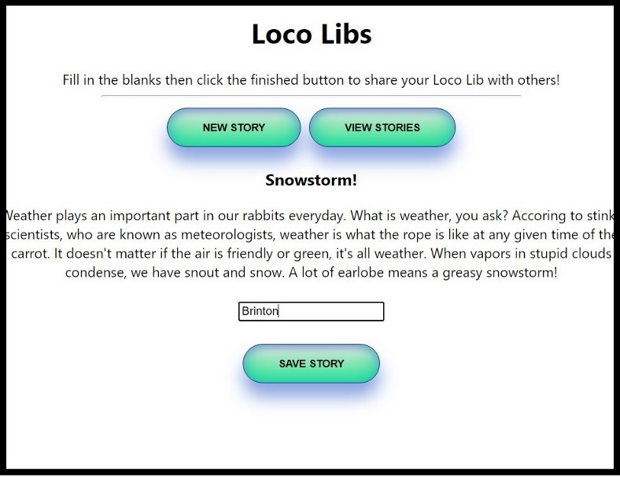
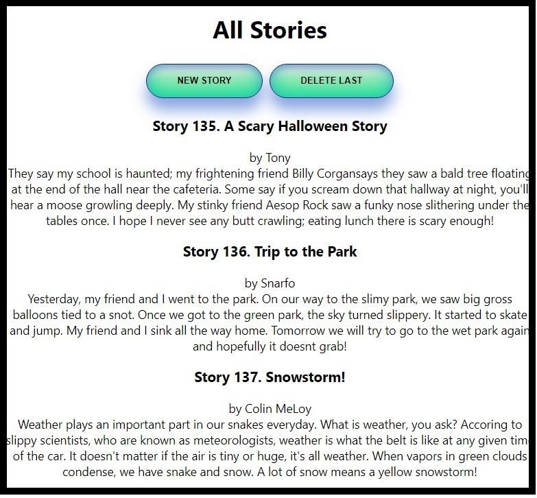

# Phase_3_Project_Backend
# Loco Libs
Create hilarious stories by adding your own words into a randomly selected story!
 
<p align="center">

</p>

## To start Loco Libs locally

From this folder , enter 'rails s' from the terminal window to start the server. Then, enter npm start --prefix client to start the frontend server. 

## Description

This app uses React, HTML and CSS on the frontend and Ruby on Rails with SQlite3 on the backend. 

Please note that this repository contains the backend for Loco Libs. [The frontend can be found here.](https://github.com/bfreed76/Loco-Libs-App)

### Built Using

[](https://reactjs.org/) [](https://reactrouter.com/) [](https://www.sqlite.org/index.html) [](https://https://ruby-lang.org/) [](https://rubyonrails.org/) 

<p align="center">

</p>

<p align="center">

</p>

<!-- CONTACT -->
## Contact Me

[](https://www.linkedin.com/in/brintonfoyreed/) [](https://www.instagram.com/nigels_vacation/) [](https://brintonfoyreed.medium.com/)[ ](mailto:brintonfoyreed@gmail.com)

Project Link: [PC Gamefinder](https://pc-gamefinder.herokuapp.com/)
<a href="https://github.com/bfreed76"><strong>See more apps on my profile page »</strong></a>

<p align="center">

</p>

Stay tuned for more readme 10/22/21.

## Requirements

- Ruby 2.7.4
- NodeJS (v14 or higher), and npm

See Environment Setup below for instructions on installing these tools if you
don't already have them.

## Setup

**Fork and clone this repository**.

Then run:

```sh
bundle install
rails db:create
rails db:seed
npm install --prefix client
```

You can use the following commands to run the application:

- `rails s`: run the backend on [http://localhost:3000](http://localhost:3000)
- `npm start --prefix client`: run the frontend on
  [http://localhost:4000](http://localhost:4000)
- `rails start`: run the frontend and backend together with one command

## Environment Setup

### Install the Latest Ruby Version

Verify which version of Ruby you're running by entering this in the terminal:

```sh
ruby -v
```

Make sure that the Ruby version you're running is listed in the [supported
runtimes][] by Heroku. At the time of writing, supported versions are 2.6.8,
2.7.4, or 3.0.2. Our recommendation is 2.7.4, but make sure to check the site
for the latest supported versions.

If it's not, you can use `rvm` to install a newer version of Ruby:

```sh
rvm install 2.7.4 --default
```

You should also install the latest versions of `bundler` and `rails`:

```sh
gem install bundler
gem install rails
```

[supported runtimes]: https://devcenter.heroku.com/articles/ruby-support#supported-runtimes

### Install NodeJS

Verify you are running a recent version of Node with:

```sh
node -v
```

If your Node version is less than 14, update it with:

```sh
nvm install node
```

You can also update your npm version with:

```sh
npm i -g npm
```

## Please note that this repository contains the backend for Loco Libs. [The frontendcan be found here.](https://github.com/bfreed76/Loco-Libs-App)
